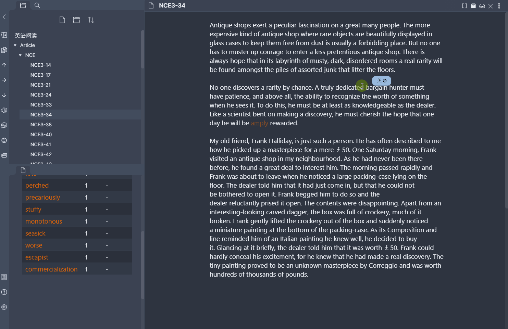
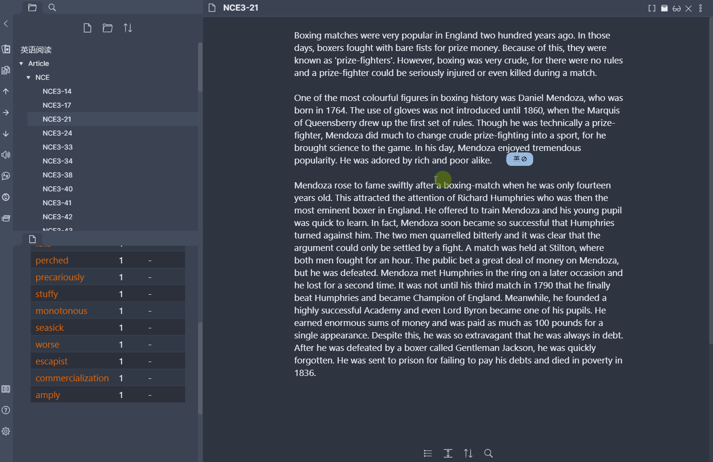
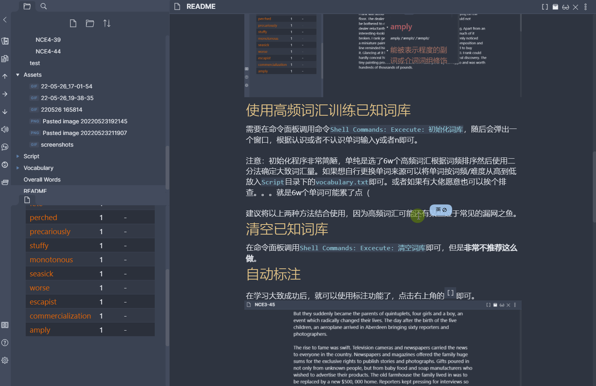
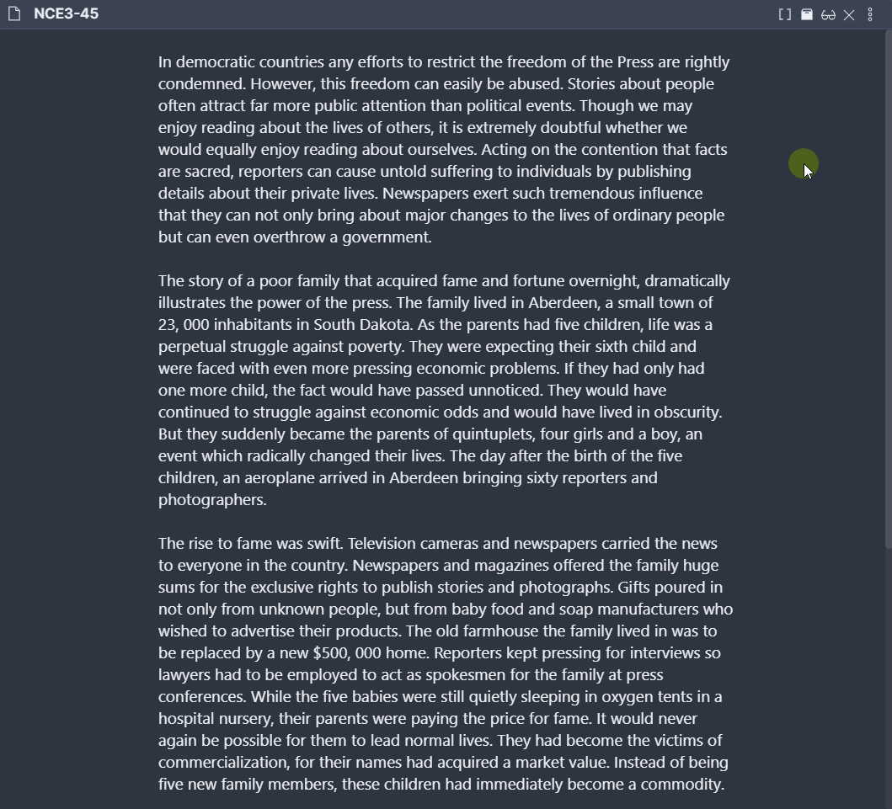
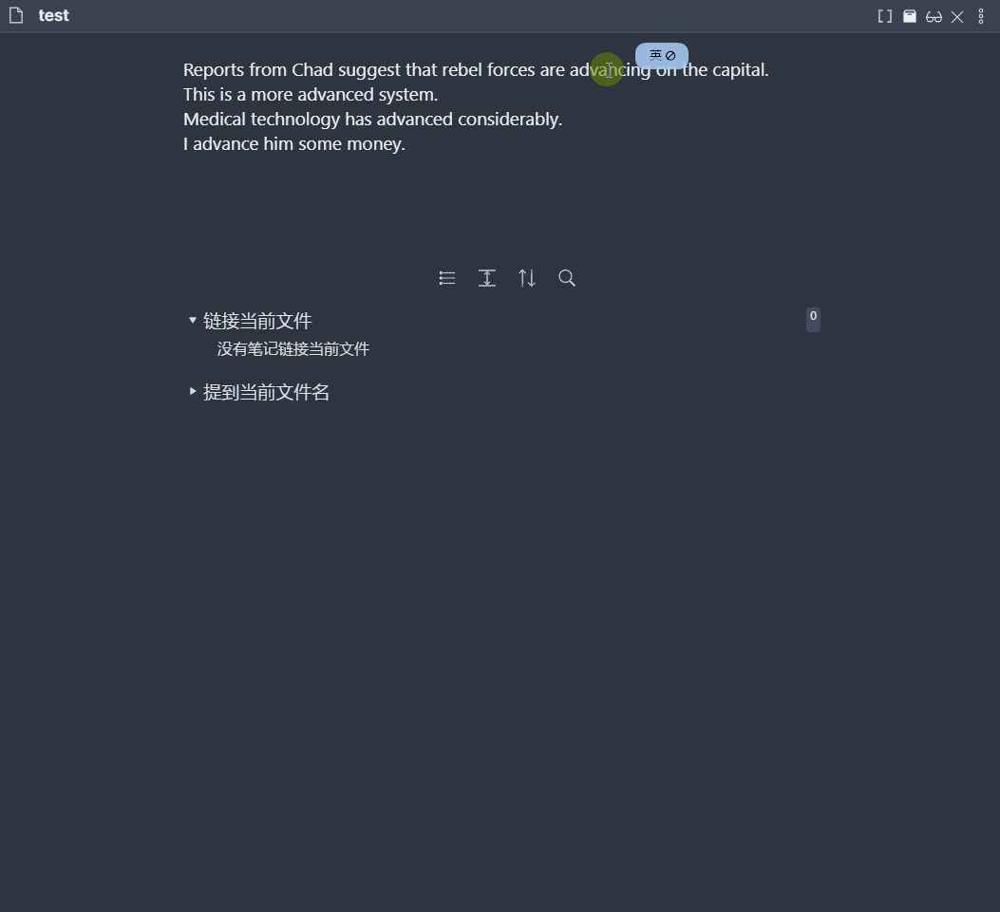

# 英语阅读库
> 本人代码新手，所以代码中有bug很可能遍地都是，所有代码及相关文件放在Script目录下，如有bug均可手动debug或者发Issue QwQ
> 本库仅在Windows11下测试过，不敢保证在MacOS或Linux上是否会出bug，不过如果出bug欢迎发Issue
## 鸣谢
- 感谢[@风尘噗噗](https://space.bilibili.com/67214698)提出思路并且构建了整个库的基础，我只是在噗噗的肩膀上做了一点微不足道的工作而已。赞美噗噗佬！噗噗佬在b站上做了很多关于ob的高质量视频，快去三连。
## 前置条件
- Python 3 及以下库：（可以通过在`Script`目录下执行`pip install -r requirements.txt`进行安装）
	- json
	- os
	- pathlib
	- sys
	- re
	- ntlk
- ntlk语料库
	- `ntlk_data.zip`可以在Script目录下和Release中找到，请自行下载并解压到C盘根目录（仅限Windows），`~`（即用户目录，根据系统而有所不同）或者Python根目录均可。注意，ntlk_data文件夹已经包含在压缩文件里，不需要套娃。如果报错请先检查是否套娃，然后再提交Issue。
## 功能
- 对任意单词标注为已知/未知
- 自动标注出文中不认识的单词并自动创建释义文件 **（仅在已知词库训练后可用，训练不完全会导致奇怪的后果）**
- 学习文章，训练已知词库
## 使用说明
所有文章放在`Article`目录下，所有单词释义文件放在`Vocabulary`目录下。

前置条件达成之后其实就可以用了，标注为已知/未知都可以用，然而整个库的灵魂：已知词库仍未训练好，这也就意味着自动标注无法使用。因此为了更好地使用本库，还需要做一些训练工作。

（本库中的已知词库是我粗略训练过的，本人词汇量1w左右，根据自己的英语水平可以决定是自己再训练一遍还是清空数据库从头开始）
### 使用文章训练已知词库
对于任意一篇英语文章，只需标注出文中所有不认识的单词，然后点击右上角的即可。如果是手动标注的单词（未使用右键菜单或者命令），学习后也会自动建立双链单词的释义文件。

（虽然听起来很高级但是本质上就是读取文章中所有没有被双链的单词然后标注为已知，并不包含任何机器学习要素）

库中已经内置了多篇新概念英语文章，可以作为素材使用。更牛的大佬可以选择到[此处](https://github.com/hehonghui/the-economist-ebooks)自行下载经济学人等多种英语报刊进行训练。本质上任何一篇文章都可以作为素材进行训练，但是建议选择符合自身水平的文章。
注意：作为所有文章必须是Markdown格式

### 使用高频词汇训练已知词库
需要在命令面板调用命令`Shell Commands: Excecute: 初始化词库`，随后会弹出一个窗口，根据认识或者不认识单词输入y或者n即可。

注意：初始化程序非常简陋，单纯是选了6w个高频词汇根据词频排序然后使用二分法确定大致词汇量。如果想自行更换单词来源可以将单词按词频/难度从高到低放入`Script`目录下的`vocabulary.txt`即可。或者如果有大佬愿意也可以挨个排查。。。就是6w个单词可能累了点（

建议将以上两种方法结合使用，因为高频词汇可能还有某些过于常见的漏网之鱼。
### 清空已知词库
在命令面板调用`Shell Commands: Excecute: 清空词库`即可，但是**非常不推荐这么做**。
### 自动标注
在学习大致成功后，就可以使用标注功能了，点击右上角的即可。

### 标注为已知/未知
在对应的词上右键，在右键菜单中选择即可。注意确保光标在单词内。

### 查词
选中单词后右键可以查词。
## 高级
所有脚本放在`Script`目录中。

`script.py`负责大部分工作，如标注文章，学习文章，标注为未知/已知等。
`init_database.py`负责初始化词库。

`front_template.md`和`back_template.md`分别在创建单词释义文件时被插入到文件的开头和末尾，可根据需求自行修改。

剩下的脚本如有兴趣可自行阅读，不过用途基本被上面两个脚本覆盖。

上述脚本具体用法参见shell commands插件的设置。

标题栏的图标和右键菜单都是用customized系列插件修改的，不满意的话可以自行修改（有没有巨佬告诉我怎么能修改右键菜单中命令的名字qwq，为什么要顶着Shell Commands那么长的名字啊啊啊啊啊啊）。

左下角是根目录下的`Overall Words.md`，右下角是Dictionary插件的查词页面。
